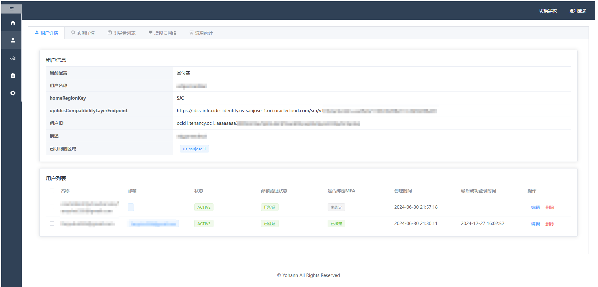
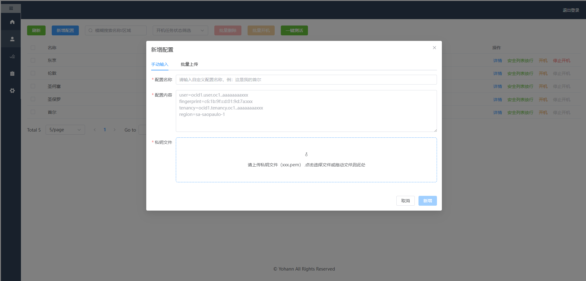
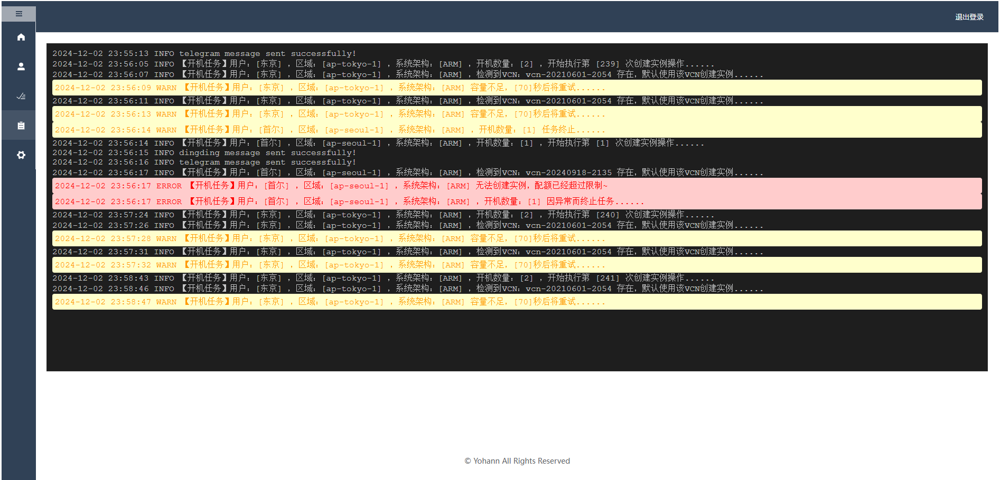
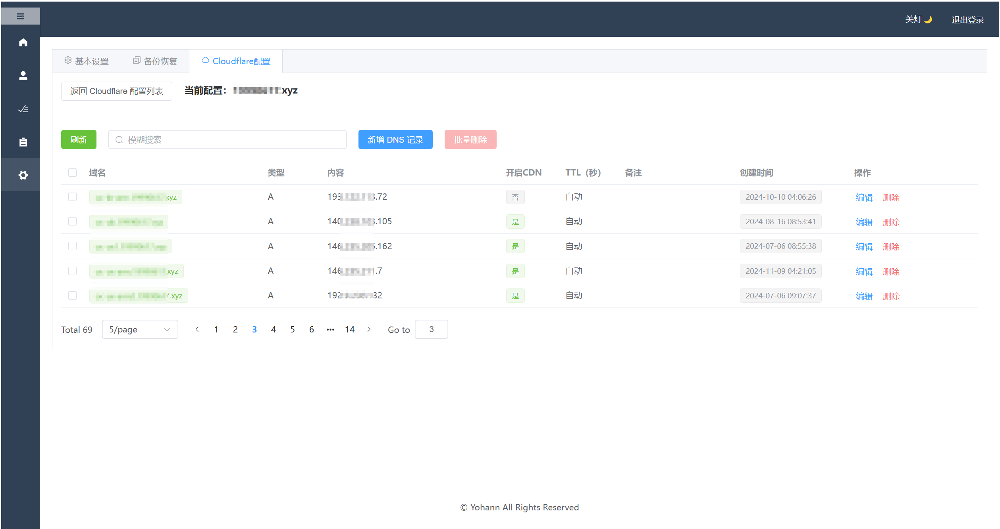
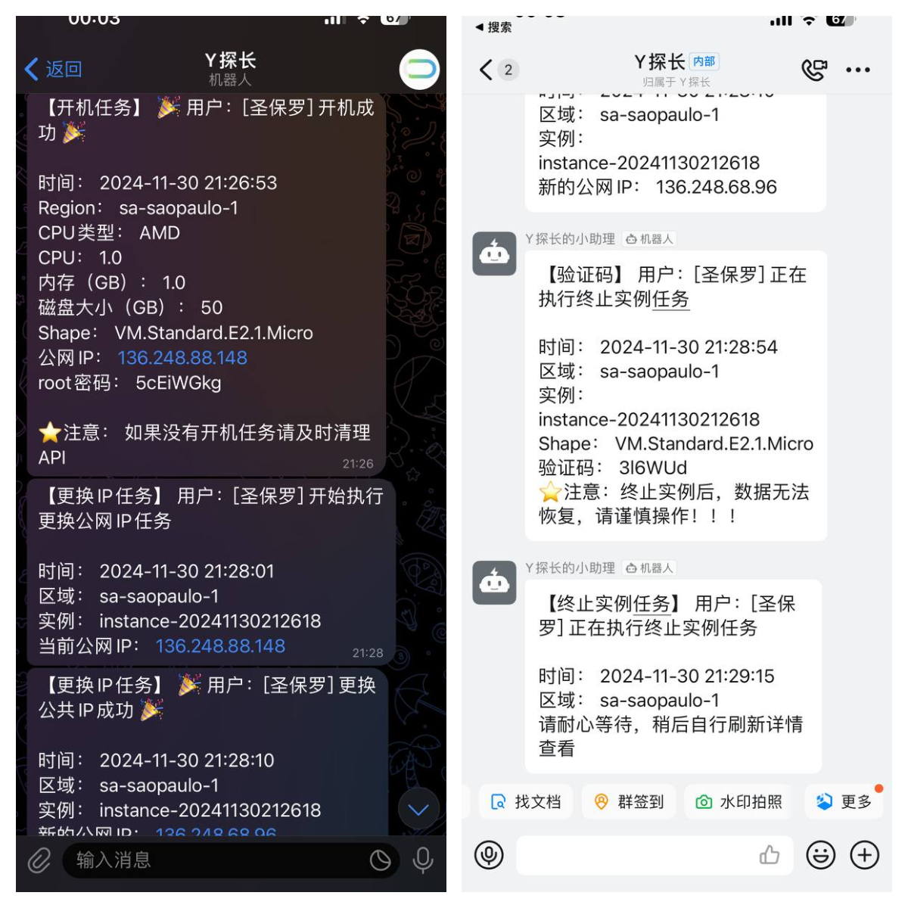

[ZH](README.md) | [EN](README_EN.md)

# oci-helper

> A web-based visual Oracle Cloud Assistant developed based on Oracle OCI SDK 🐢. The currently implemented functions include: batch adding multiple tenant configurations, changing instance configurations and boot volume configurations, attaching ipv6, security lists, real-time traffic query (minute level), changing instance public IPs according to multiple CIDR network segments, batch grabbing of multiple tenants at the same time, breakpoint resumption, backup and recovery, real-time log viewing, message notifications, MFA login verification, Update Cloudflare DNS records and other functions.

## Notes and Disclaimer

- 🔑It is recommended to use low-privilege APIs. Please refer to the tutorial of [@ Jin Gu Bang](https://t.me/jin_gubang): [How to generate 
  low-privilege APIs](https://telegra.ph/oralce-api-role-05-05)
- ⚠️I am not responsible for account suspension due to high frequency of booting and changing IP.
- ❤️The development of this project is purely personal hobby, no backdoor, and safe to use.
- 🔒It is strongly recommended not to use naked HTTP access, and HTTPS access should be configured using Nginx reverse proxy.
- 🔐It is recommended to use a key to log in to the server to prevent the server from being blasted by SSH, resulting in API data and key leakage.
- 📃Remember to clean up the docker logs regularly~

## Core functions

1. Support **batch adding** multiple tenant configuration information at the same time, and all paginated lists support **fuzzy search** and **status filtering**.
2. Support changing instance configuration, boot volume configuration, one-click attachment of ipv6, one-click release of all ports, instance list, boot volume list, **security list**, **real-time traffic statistics (minute level)** and other functions.
3. Change the instance public IP according to multiple **CIDR network segments**. If you encounter abnormalities such as frequent requests, they will be directly ignored and will not affect the next execution until the IP of the specified IP segment is changed.
4. Multiple tenants **batch start** at the same time, and the background will run until the startup is successful.
5. Support **breakpoint continuation**, the configuration and machine grabbing tasks are saved in the local database, and the machine grabbing tasks will continue to be executed when the service is restarted, without repeated configuration.
6. Support multiple area codes (configuration items are distinguished by region). For example: I have a 4-area code, then add 4 configurations, modify the region, and other configuration items are the same.
7. Support **real-time viewing of backend logs** on the front-end page.
8. Support **encrypted backup and recovery**, realize seamless data migration, convenient and fast.
9. Support **MFA** login verification function (not Turtle Shell, but the login of my panel) to ensure the security of the service.
10. Support update **Cloudflare** DNS record function

## One-click docker-compose deployment or update

- After the installation is complete, you can directly access it through `ip:8818` in the browser (it is recommended to access it through https later). The default account and password are both: `yohann`.
  If you need to modify it, please change the configuration in `/app/oci-helper/application.yml` and execute `docker restart oci-helper` to restart the docker container.
- If you need to view the complete log, execute: `docker logs oci-helper >> /app/oci-helper/oci-helper.log` to export the log file and view it yourself.

```bash
bash <(wget -qO- https://github.com/Yohann0617/oci-helper/releases/latest/download/sh_oci-helper_install.sh)
```

This command can also be used to update the image and restart the container without deleting the existing configuration.

### 📃Update log

> November 30, 2024 - A new table was added to the database. TG and DingTalk message notifications are changed to be configured on the web page. If you encounter a configuration exception, please delete the `application.yml` file, then re-execute the one-click command, modify the custom account password, and restart the container with `docker restart oci-helper`.

## Manual deployment (not recommended)

<details>
    <summary> ☜ Read more 👨‍💻</summary>

### 1. Create a new directory

Create a key file storage directory `/app/oci-helper/keys` to store the `key file.pem` downloaded when generating the API from the Oracle Cloud Console. When adding a new oci configuration, just enter `key file name.pem`. The full path of this directory will be added by default.

```bash
mkdir -p /app/oci-helper/keys && cd /app/oci-helper
```

### 2. Download files

1. Download the latest `application.yml` and `oci-helper.db` files in `Releases` to the `/app/oci-helper` directory, and modify some configurations of `application.yml`.
2. If you do not use docker deployment, download another `oci-helper-1.1.7.jar` file to the `/app/oci-helper` directory, and run it directly `nohup java -jar oci-helper-1.1.7.jar > /var/log/oci-helper.log &` (the prerequisite is that the environment must have `jre8` or `jdk8`).
3. If you update the jar package or docker image later, you need to install sqlite and run the command to update the version number in `sh_oci-helper_install.sh` (solve it yourself).

### 3. Docker deployment

The docker environment needs to be installed in advance, supporting arm64 and amd64 architectures.

#### 3.1 Method 1

Run directly with docker:

```bash
docker run -d --name oci-helper --restart=always \
-p 8818:8818 \
-v /app/oci-helper/application.yml:/app/oci-helper/application.yml \
-v /app/oci-helper/oci-helper.db:/app/oci-helper/oci-helper.db \
-v /app/oci-helper/keys:/app/oci-helper/keys \
ghcr.io/yohann0617/oci-helper:master
```

#### 3.2 Method 2

Download the latest `docker-compose.yml` in `Releases` to the `/app/oci-helper` directory and run the following command:

```bash
docker compose up -d
```

Update the latest image:

```bash
docker compose pull && docker compose up -d
```

</details>

## Page display













## Stargazers over time

[](https://starchart.cc/Yohann0617/oci-helper)
