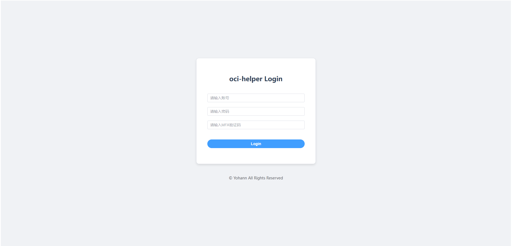
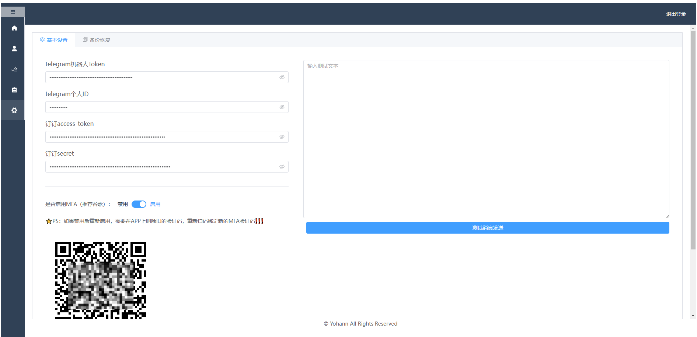
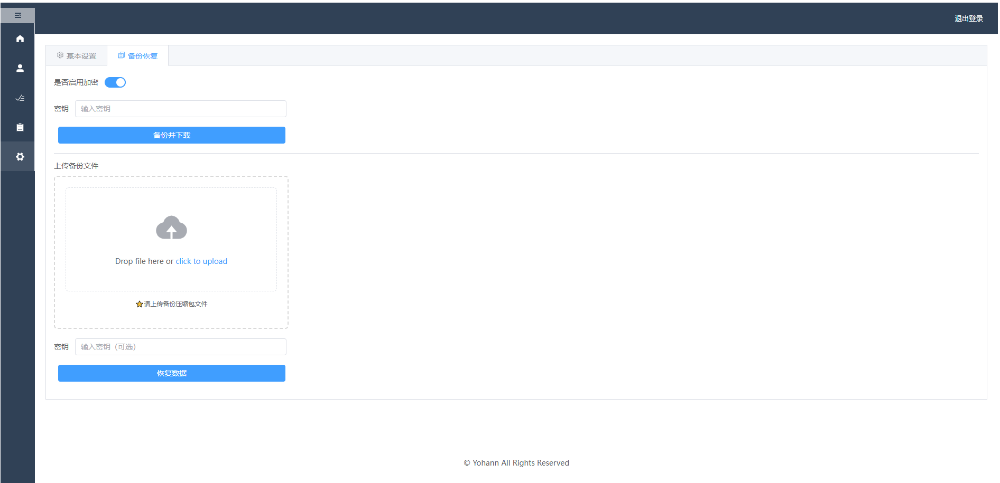

[ZH](README.md) | [EN](README_EN.md)

# oci-helper

> A web-based visual Oracle Cloud Assistant developed based on Oracle OCI SDK. Currently implemented functions include: support for adding multiple tenant configurations, querying tenant instance information, changing instance public IP according to multiple CIDR network segments, multi-tenant grabbing, breakpoint resumption, etc.

## Notes and Disclaimer

- It is recommended to use low-privilege APIs. Please refer to the tutorial of [@ Jin Gu Bang](https://t.me/jin_gubang): [How to generate 
  low-privilege APIs](https://telegra.ph/oralce-api-role-05-05)
- I am not responsible for account suspension due to high frequency of booting and changing IP.
- The development of this project is purely personal hobby, no backdoor, and safe to use.
- It is strongly recommended not to use naked HTTP access, and HTTPS access should be configured using Nginx reverse proxy.
- It is recommended to use a key to log in to the server to prevent the server from being blasted by SSH, resulting in API data and key leakage.
- Remember to clean up the docker logs regularly~

## Core functions

1. Manage multiple tenant configuration information at the same time, support fuzzy search and status filtering.
2. Change the instance public IP according to multiple **CIDR network segments**. If there are abnormalities such as frequent requests, they will be ignored directly and will not affect the next execution until the IP in the specified IP segment is changed.
3. Multi-tenant **batch startup** at the same time, the background will run until the startup is successful.
4. Support **breakpoint continuation**, the configuration and grabbing tasks are saved in the local database, and the grabbing tasks will continue to be executed after the service restart, without repeated configuration.
5. Support multiple area codes (configuration items are distinguished by `region`). For example: I have a 4-area code, then add 4 configurations, modify `region`, and other configuration items are the same.
6. Support front-end page **real-time viewing of back-end logs**.

## One-click docker-compose deployment or update

After the installation is complete, you can access it directly in the browser `ip:8818` (it is recommended to access it through https later). The default account and password are: `yohann`. If you need to modify it, please change the configuration in `application.yml` and execute `docker restart oci-helper` to restart the docker container. `Key_file.pem` must be named in English and uploaded to the `/app/oci-helper/keys` directory. When adding oci configuration, you only need to enter `key_file_name.pem`, and the full path of this directory will be added by default.

```bash
bash <(wget -qO- https://github.com/Yohann0617/oci-helper/releases/latest/download/sh_oci-helper_install.sh)
```

This command can also be used to update the image and restart the container without deleting the existing configuration.

### ⭐Update log

> November 30, 2024 - A new table was added to the database. TG and DingTalk message notifications were changed to be configured on the web page. If you encounter a configuration exception, please delete the `application.yml` file, then re-execute the one-click command, modify the custom account password, and restart the container.

## Manual deployment

### 1. Create a new directory

Create a key file storage directory `/app/oci-helper/keys` to store the `key file.pem` downloaded when generating the API from the Oracle Cloud Console. When adding a new oci configuration, just enter `key file name.pem`. The full path of this directory will be added by default.

```bash
mkdir -p /app/oci-helper/keys && cd /app/oci-helper
```

### 2. Download files

1. Download the latest `application.yml` and `oci-helper.db` files in `Releases` to the `/app/oci-helper` directory, and modify some configurations of `application.yml`.
2. If you do not use docker deployment, download another `ocihelper-0.0.1.jar` file to the `/app/oci-helper` directory, and run it directly with `nohup java -jar ocihelper-0.0.1.jar > /var/log/oci-helper.log &` (the prerequisite is that the environment must have `jre8` or `jdk8` or above).

### 3. Docker deployment

The docker environment needs to be installed in advance, supporting arm64 and amd64 architectures.

#### 3.1 Method 1

Run directly with docker:

```bash
docker run -d --name oci-helper --restart=always \
-p 8818:8818 \
-v /app/oci-helper/application.yml:/app/oci-helper/application.yml \
-v /app/oci-helper/oci-helper.db:/app/oci-helper/oci-helper.db \
-v /app/oci-helper/keys:/app/oci-helper/keys \
ghcr.io/yohann0617/oci-helper:master
```

#### 3.2 Method 2

Download the latest `docker-compose.yml` in `Releases` to the `/app/oci-helper` directory and run the following command:

```bash
docker compose up -d
```

Update the latest image:

```bash
docker compose pull && docker compose up -d
```

## Page display








## Stargazers over time

[](https://starchart.cc/Yohann0617/oci-helper)
